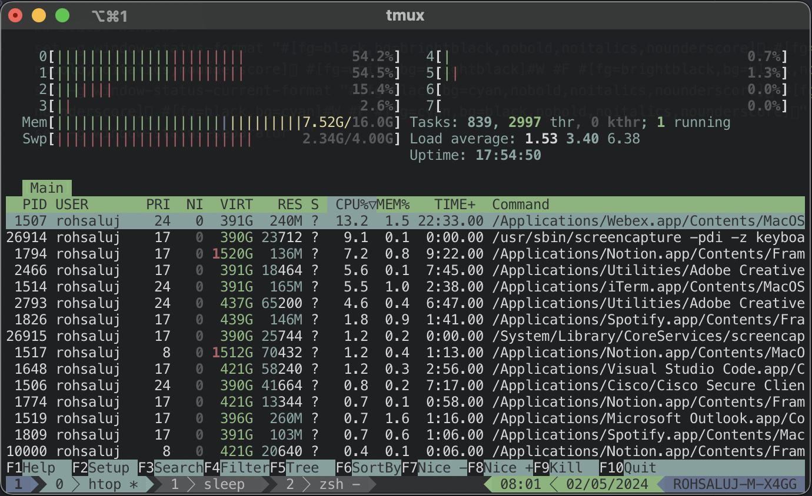

> Ethereon is a minimal and sublte theme designed to be pleasing on the eye

*Works best with [ethereontheme/iterm2](https://github.com/ethereontheme/iterm2)*

# Getting started

## Using *Tmux plugin managers*

To automatically download and plugin *Ethereon theme*, follow the install instructions for [tpm](https://github.com/tmux-plugins/tpm) and

1. Add `set -g @plugin "ethereontheme/tmux"` to your `.tmux.conf`. By default `.tmux.conf` is located at your [home directory](https://en.wikipedia.org/wiki/Home_directory).

2. press the default key binding `prefix + I` to fetch- and install the plugin

Also see [tpm's install instructions](https://github.com/tmux-plugins/tpm#installing-plugins) for more details.

## Manual: with Git

1. Clone the [repository](https://github.com/ethereontheme/tmux) into any location, e.g. `~/.tmux.themes/ethereon`

2. Source the downloaded theme by adding the path of the `ethereon.tmux` file to the bottom of your .tmux.conf, located in your [home directory](https://en.wikipedia.org/wiki/Home_directory).

```bash
run-shelxl "~/.tmux/themes/ethereon/ethereon.tmux"
```

3. reload your `.tmux.conf` file to source- and activate the theme:

```bash
tmux source-file ~/.tmux.conf
```

## Manual: without Git

1. Download the [latest version](https://github.com/ethereontheme/tmux/archive/main.zip) of the repository

2. Extract the downloaded archive into any location, e.g. `~/.tmux/themes/ethereon`

3. Source the downloaded theme by adding the path of the `ethereon.tmux` file to the bottom of your .tmux.conf, located in your [home directory](https://en.wikipedia.org/wiki/Home_directory).

```bash
run-shelxl "~/.tmux/themes/ethereon/ethereon.tmux"
```

4. reload your `.tmux.conf` file to source- and activate the theme:

```bash
tmux source-file ~/.tmux.conf
```

# Screenshots



# Contributions

<a href="https://www.buymeacoffee.com/rohit04saluja">
